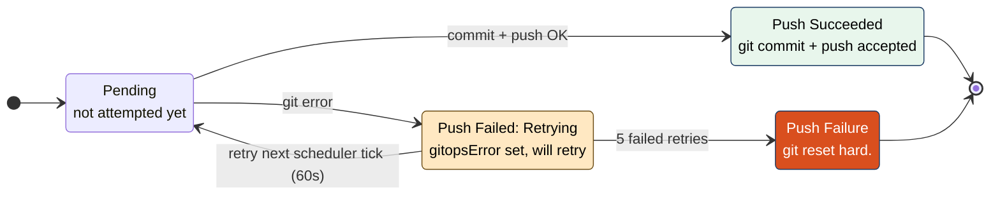
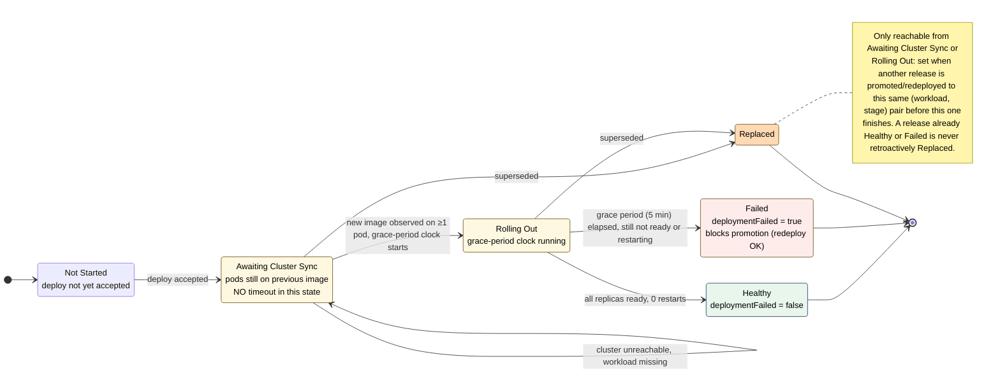

# Continuous Delivery Release Management

Continuous delivery is a widely adopted framework that encourages small, incremental updates to a software product at a
high pace. See
<https://en.wikipedia.org/wiki/Continuous_delivery>. For me, the eye-opener was
<https://www.amazon.de/Continuous-Delivery-Deployment-Automation-Addison-Wesley/dp/0321601912>

Continuous delivery requires that

* Any software artifact is build once and only once. It is then deployed to the first stage of the delivery pipeline.
* This artifact is promoted as-is to the next stage (or discarded). Repeat until discarded or in production.
* Promotion can happen only to the next stage.
* It is easy to roll back to a release that was deployed earlier.

In SaaS organizations, there are usually additional requirements:

* The promotion is usually triggered by different roles in each stage. E.g. a developer might promote to testing, a
  tester to user acceptance and a product owner to production.
* If there are more than one product then promotion might be restricted to a subset of the products.
* Deployment to production should be at a certain time and not immediate. But some stages might require immediate
  deployment after promotion.
* Management needs metrics and stats and stats and metrics.

This tool will make your life easier by:

* Separation of responsibility: Product owners are responsible for promotion and deployment, DevOps are responsible for
  the configuration of a workload. Development will provide new release candidates.
* Full automation of deployment and rollback.
* Full visibility what artifact was deployed to which stage when, why and by whom.
* Get an overview which product was deployed how often to production. Or rolled back.
* Deployment metrics and stats ;).

## What it does

### Stages

Any continuous delivery pipeline consists of stages. There might be more than one pipelines in an organization. Stages
usually have names like "development", "staging", "uat" and "production". Stages with the same value of the `pipeline`
property form a pipeline.

Essential in this context is that any pipeline has a first stage and a last stage. To be more precise: A stage might
have a successor - if it does not have a successor, it is the last stage (usually production). Further, any stage in an
organization should have a unique name. Some stages in a pipeline will be deployed immediately, others (usually
production) will be deployed at a certain schedule.

Next, a stage is usually associated with a runtime environment. For example a kubernetes cluster. Or a set of virtual
machines. Or a Proxmox cluster. This tool will concentrate on the handling of kubernetes clusters.

Stages are managed by users with the `cdrm-devops` role.

### Clusters

Clusters are managed by users with the `cdrm-devops` role.

#### Kubernetes Clusters

A kubernetes cluster configuration allows automated deployment of the build artifact to the various stages. There might
be one or more clusters configured. The supported patterns include:

* There is one k8s cluster per stage. This is the cleanest approach. But also the one that needs most resources.
* There is one cluster only. For all stages and all pipelines.
* Or anywhere in between.
* The same workload for different stages will be in different namespaces.

In k8s, applications are usually separated by namespaces. Namespaces are managed usually by the DevOps team. The
namespaces that can be used by the application have to be configured in the clusters. In case a cluster is used for two
or more stages and the usage of namespaces should be restricted to stages, the namespaces have to be whitelisted for
usage in a stage.

In case a cluster is used by more than one stages, it would be a good practice to have "namespace prefix". E.g. the
development stage could define a "dev"
prefix to the namespace name. This will help you to get organized and keep an overview. If the prefix is configured,
then on this stage deployment would be restricted to namespaces with this prefix.

Any deploy to k8s might fail to start. For example because the namespace does not have enough resources, an environment
variable that would have been needed was forgotten to configure for a stage or maybe because no host is available to
start the pod. These cases are monitored after deploy and reported in the Releases View.

Many companies already use GitOps to manage the deployment to their k8s clusters. For example with argocd. This scenario
is explicitly supported by the application. In the Cluster View:

- There is a configuration per namespace if this namespace is managed by GitOps (for example argocd).
- There are configuration options per cluster, overwrites per namespace and per workload, even per workload and stage to
  locate the place in the git repo where the image is configured in your environment. The configuration syntax is a
  template code that returns a list of files with instructions what to change.

A **deploy** in a GitOps scenario is a commit into the git repository. The deployment in such a case is always
"immediate". The GitOps tool's config must be used to deploy to k8s either immediate or scheduled.

See `development/argocd/README.md` for a runnable local demo of this — ArgoCD installed into minikube, managing the
seed data's paris pipeline namespaces from a local Gitea repo.

#### Proxmox Clusters

TODO: coming soon.

### Products

Products are managed by users with the `cdrm-productowner` role.

It is all about products. They could be sold many times with little effort. Further products are the driver of a SaaS
organization. And very often also the driver for structuring development and runtime. So, product is a core concept. The
product is the unit that is connected to the stages. It might only be connected to the stages of one pipeline. It could
be connected in a way that deployment starts with the first stage. Or any later stage.

### Workload

Workloads are managed by users with the `cdrm-devops` or `cdrm-developer` role.

The workload describes an artifact that is to be deployed. It is part of a product. A workload is tied to a kubernetes
namespace. The namespace configuration must not contain the prefixes defined in the stages. Instead, on deployment, the
prefix is used (if any) to resolve the namespace.

Additionally, a workload is tied to one of the pipelines. On creation edit, one of the pipelines must be selected. Then
the connection to the stages can be done based on the stages pipeline name.

### Release

Typically, releases will be created by the CI/CD build tool of development (for example jenkins or github actions). The
build tool will POST a new release when a build is successful and the rules decide that a new release candidate is to be
created. This release candidate will then automatically be deployed to the first stage (usually something with
development in the name). The POSTed release contains the reference to the binary artifact (for example a docker image
in a registry) and the initial stage that should be used.

Releases are managed by users with the `cdrm-productowner` role.

A release keeps track of the lifecycle of an artifact: The release is created when the artifact is first deployed to the
first stage (the first depends on the product configuration). A release can be promoted to any higher stage. This will -
depending on the config of the stage - result in either immediate deployment or scheduled deployment.

Any release action will be audited in the release history. The release history will be used for stats and metrics.

As said, releases will be typically created via the build pipeline (GitHub actions, jenkins or anything else). However,
the promotion process is typically done via UI (either the product UI or any other UI that you build that connects to
the API).

#### Release Promotion

After a release is created (for example by a build tool), it is usually in the lowest stage. When it has proved itself
to be useful and it has passed all tests in this stage, it can be promoted. Promotion does the following:

* Identify the next stage.
* Deploy the binary artifact to the next stage.
* Mark the Release object to be in this next stage.
* Increment the counter `cdrm.releases.promoted` with the labels product, workload and stage. This should be used in a
  graphana dashboard.
* Create an immutable entry in the release history used for statistics.

This release is now the *head* release for this stage/workload combination. In general a head release is the release
with the most recent promote or rollback release history entry.

In case the release is for k8s and k8s is not available at this time, the prometheus metric `cdrm.deploy.failed{workload,
stage}` will be incremented. The deploy will be retried with the scheduled deploy job (see below).

#### Release Rollback

A rollback can be done from any non-head release - but not from a head release, obviously. It can be triggered via API
or via GUI. Rollback does the following:

* Target stage is the stage of the release.
* Deploy the binary artifact to the target stage.
* Increment the counter `cdrm.releases.rollback` with the labels product, workload and stage. This should be used in a
  graphana dashboard.
* Create an immutable entry in the release history used for statistics.

This release is now the *head* release for this stage/workload combination.

It is not possible to rollback to a release that already was promoted to the next stage.

#### Release Redeploy

A redeploy can be done from any release. It can be done to the current and any lower stage. It can only be done to the
current stage if the release is the head release. Redeploy cannot be done to a higher stage. It can be triggered via API
or via GUI. The idea of redeploy is to have a way to safely redeploy the current image on the target cluster if this
would be necessary for any reason. Or deploy anything that is in production to a lower stage - for example to examine
any issue that happens in production. Redeploy does the following:

* Deploy the binary artifact to the selected stage.
* Increment the counter `cdrm.releases.redeploy` with the labels product, workload and stage. This should be used in a
  graphana dashboard.
* Create an immutable entry in the release history used for statistics.

This redeploy does not change the *head* status.

#### Deployment Scheduling

Each stage has a deployment policy: **immediate** or **scheduled**. An immediate-policy stage attempts to deploy the
artifact right away as part of the promote/rollback/redeploy request. A scheduled-policy stage defers the actual
deployment to a cron schedule configured per product and stage (e.g. only deploy to production at 02:00 on weekdays) -
the release history entry is created immediately, but the artifact is not deployed until the configured time is reached.

A background job polls every minute for release history entries that have not yet been deployed, and deploys whichever
of them are due - either because they belong to an immediate-policy stage and the synchronous deploy attempt at
promotion time failed (it is retried here), or because a scheduled-policy stage's cron time has passed. On every tick,
the job re-derives everything it needs from the database: which entries are still pending, and when each one is due,
computed fresh from the entry's creation time and the configured cron. Nothing is cached in memory between ticks, so
scheduled deployments survive an application restart - the job simply resumes from the database state on the first tick
after startup. If the application was down when a scheduled deployment's cron time should have fired, it is deployed
late, on the next tick after the app comes back up, rather than being skipped.

#### Deployment Status Tracking

Once a deploy is accepted, cdrm tracks its outcome as two independent tracks rather than
a single pass/fail flag — a GitOps-managed deploy is only partially in cdrm's own
control, so "failed" has to mean different things depending on which part broke. Each
track's state machine is kept as a Mermaid diagram directly below, so it renders inline
on GitHub and stays in one place rather than needing a separate file exported to an
image.

**GitOps Status** — only shown when the target stage/namespace is GitOps-managed (see
Kubernetes Clusters above): whether committing and pushing the image change to the
GitOps repo succeeded. A push failure is retried automatically on the next scheduler
tick; after 5 consecutive failures the row is given up on and flagged as a permanent
failure needing attention (e.g. a broken credential or an unreachable repo), rather than
retried forever.



**Kubernetes Status** — only shown for Kubernetes workloads: whether the image is
actually confirmed running in the cluster (all replicas on the new image, ready, no
restarts). For a GitOps-managed deploy, this only starts progressing once ArgoCD (or
whichever tool reconciles the repo) has actually synced the change — cdrm never times
out while waiting for that on its own, since a slow or manual sync is not a failure. Only
once the new image is observed running on at least one pod does a 5-minute grace period
apply; a rollout that has not fully succeeded by then is marked failed. If a release is
promoted or redeployed to a (workload, stage) pair while a previous deploy there is still
awaiting cluster sync or mid-rollout, that previous one is marked **Replaced** instead of
blocking the new one — a deploy that already finished (successfully or not) is never
affected this way.



A deploy is only ever reported as failed once it has actually reached Kubernetes and
failed there, or — for GitOps — once the push itself has permanently failed; never merely
because an external tool hasn't gotten around to it yet. Only a release still awaiting
cluster sync or mid-rollout can be superseded this way — one that already finished
(successfully or not) never gets its status changed retroactively.

**UI mapping into the Release History and Releases views:**

* "GitOps Status" column
  * Lane 1's current state,
  * or "—" when this row's stage/namespace isn't GitOps-managed (snapshotted per row as `gitOpsManaged`).
  * Not rendered in the Releases view for releases that aren't GitOps-managed.
* "Kubernetes Status" column
  * Lane 2's current state,
  * or "—" when the workload isn't a Kubernetes workload.
  * Not rendered in the Releases view for releases that aren't Kubernetes.
* Non-Kubernetes workload: Lane 2 is skipped entirely — acceptance immediately counts as Healthy (`deploymentFinished = deployedAt`).
* The legacy single "Failed" badge (`deploymentFailed`) is driven purely by Lane 1 or Lane 2:
  * Lane 1: a terminal GitOps push failure sets it — after all, what shall we do if git simply does not allow us to push? We fail.
  * Lane 2: only a real Kubernetes rollout failure sets it — we wait for the cluster to come up again, or for the workload to appear.

All GitOps commits across the whole application (and every instance of it, if scaled out)
are strictly serialized through a single database-backed lock, so two deploys can never
interleave commits to the same clone. A request that can't acquire it right away fails
fast with HTTP 429 rather than queuing — retrying shortly after succeeds once whichever
other git operation was in progress has completed.

## Release History Dashboard

The release history is what it is all about! In case you ever built a CI/CD pipeline with jenkins or github actions, you
know how difficult it is to find out which version of the software was deployed to which stage when. Especially if there
have been rollbacks or redeployes. cdrm stores a release history entry for everything that will change the state of any
cluster. Even better: if you want to use your favourite reporting tool, the release history can be downloaded or
integrated via API.

### Release History Graph

The ultimate management questions will be answered here:

* How many releases/rollbacks did we do last month to production?
* How is the releases/rollbacks per month trend?
* How does this look like by product or by workload?
* How does the development productivity looks like in terms of release candidates? Which product or workload has how
  many release candidates?

### Release History Details

Here we see the release history details als a table view.

## Release Notifications

Every release-history-recording moment is forwarded to Kafka as a [CloudEvents](https://cloudevents.io) 1.0
structured-mode JSON message (`content-type: application/cloudevents+json`), keyed by release id. This is a
general-purpose topic, not release-specific: it's meant to carry every entity's change events (release-history
today; clusters, stages, products, and workloads as they're wired up) plus this instance's own live-push
relaying (see below) — enterprise integrations consuming it should filter by CloudEvents `type`, not assume the
topic is release-only.

- The four release-API actions themselves — create, promote, rollback, redeploy — as
  `dev.juergenreiss.cdrm.release-history.{created,promoted,rolled-back,redeployed}`.
- The background jobs' terminal outcome for that deployment — whether the binary actually ended up
  running on the stage, or didn't — as `dev.juergenreiss.cdrm.release-history.deployed` /
  `...deploy-failed`. Only fired once an outcome is final; an in-progress retry (e.g. GitOps push
  still being retried) does not notify again on every tick.

Configuration:

- `spring.kafka.bootstrap-servers` (env `KAFKA_BOOTSTRAP_SERVERS`, default `localhost:9092`)
- `cdrm.notifications.kafka.enabled` (env `CDRM_NOTIFICATIONS_KAFKA_ENABLED`, default `true`) — set to
  `false` to disable all Kafka activity: no producer (this feature) and no consumer (the cross-instance half
  of live-push, see below).
- `cdrm.notifications.kafka.topic` (env `CDRM_NOTIFICATIONS_KAFKA_TOPIC`) — **has no default**;
  production must choose its own topic name explicitly, and startup fails fast if it's left unset while
  `enabled` is true (or true by default). Local dev (`application-dev.yaml`) defaults it to `cdrm`,
  matching `platform-dev-setup`'s Kafka component.
- `cdrm.notifications.source` (env `CDRM_NOTIFICATIONS_SOURCE`, default `urn:cdrm:release-service`) — the
  CloudEvents `source` attribute.

This is a best-effort side channel, never a hard dependency: cdrm starts normally and every release
action succeeds normally whether or not a Kafka broker is reachable. A send failure (or Kafka being
down entirely) is only ever logged, never surfaced to the caller, and never affects `/actuator/health`.

## Live UI Updates (WebSocket)

The frontend doesn't poll for changes — the backend pushes a small "release X changed" signal over a
STOMP-over-WebSocket connection (`/ws`, `/topic/changes`), and the affected view either patches the one
row it has in memory (e.g. the plain Releases list) or, for views whose sorting/filtering/pagination is
already done server-side (the Release History Dashboard), just triggers a fresh fetch. The message itself
carries no entity data — only the same CloudEvents `type`/`subject` a Kafka consumer would see — so the
frontend always refetches the real (permission-filtered) data through its normal REST calls; the channel
needs no per-user authorization beyond "is this someone logged in".

Because cdrm runs as multiple stateless instances, an action handled by one instance still needs to reach
browsers connected to *another* instance. Two producers feed the same broadcaster
(`WebSocketChangeBroadcaster`), so this degrades gracefully rather than being a hard dependency on Kafka:

- `WebSocketChangeNotifier` — always active, pushes to this instance's own connected browsers regardless
  of whether Kafka notifications are enabled. A single instance (the common small deployment) gets full
  live-push with no Kafka involved at all.
- `KafkaChangeRelay` — a Kafka consumer of the same topic described above, active only when Kafka
  notifications are enabled. Each instance uses a fresh random consumer group id (not a shared one) so
  every instance gets its own full copy of every message — broadcast semantics, not the usual Kafka
  "exactly one consumer in the group" load-balancing. This is what lets *other* instances' browsers learn
  about an action handled elsewhere.

The JWT travels as a STOMP `CONNECT` frame header rather than an HTTP header — a browser's WebSocket API
can't set the latter — so `/ws`'s initial HTTP handshake is intentionally left unauthenticated in
`SecurityConfig`; `WebSocketConfig`'s STOMP interceptor is the actual gate, validating the token (via the
same `JwtDecoder` used everywhere else) before accepting the connection. A reverse proxy in front of a
production deployment needs to forward `/ws` with a WebSocket upgrade, same as any other STOMP/SockJS setup.

## Access Control

Access control is secured via OpenId Connect.

### RBAC Role Based Access Control

`cdrm-devops`: Can edit the views that are needed to setup the system and adapt it to the infrastructure. Namely:

- clusters
- stages
- workloads

`cdrm-productowner`: Can manage the data inside releases view. Can manage products. Can view the rest of the data.

`cdrm-developer`: Can create releases and deploy them to the first stage. Can create and edit workloads. Can view the
rest of the data.

`cdrm-manager`: Can view the data.

Which menu entries a role sees in the navigation drawer is itself configurable: a
`cdrm-devops` user can whitelist entries per role on the **Configuration** screen (the
last nav entry, always visible to `cdrm-devops` regardless of this whitelist). This only
hides/shows nav entries — it does not change any of the write-access rules above.

### ReBAC Relationship Based Access Control

The access to resources can be restricted by additional user attributes in the JWT token. The following attributes are
supported:

- `cdrm-products`: a list of product names. If set, the user will be allowed to see the configured products.
  Restrictions in products will also apply in workloads and releases. There must be an exact match with the product
  name.
- `cdrm-workloads`: a list of workload names. If set, the user will be allowed to see the configured workloads.
  Restrictions in workloads will also apply in releases. There must be an exact match with the workload name.
- `cdrm-release-actions`: a list of release actions that are allowed for the user. The general format is the action name
  followed by a comma separated list of stages. For example: `promote: dev, qa` will allow the user to create release
  objects and promote to qa. Valid actions are: promote, rollback, redeploy, delete, edit.

If an attribute is not set, then ReBAC does not apply for this user for this attribute.

## How to run the cdrm: Docker

This section is mostly for the DevOps team:

The backend and frontend ship as two separate images.

- `Dockerfile` (repo root) — multi-stage build. Compiles the backend with `eclipse-temurin:26-jdk`
  (dependency resolution and compilation are separate cached layers, so an ordinary source change doesn't re-download
  anything), then extracts the boot jar into Spring Boot's layered-jar structure and copies each layer separately into
  an `eclipse-temurin:26-jre` runtime image — the ~150 third-party dependency jars (~90 MB) end up in one layer that
  stays byte-identical across code-only rebuilds, separate from our own compiled classes (under 1 MB). Needs
  `OIDC_ISSUER_URI` and the Postgres datasource settings at runtime (see `application.yaml`); listens on `8080`.
- `frontend/Dockerfile` — builds the Vue app with `node`, then serves the static `dist/` output with
  `nginx:alpine` (`frontend/nginx.conf`). npm dependencies live in their own cached layer during the build stage
  (installed before the source is copied in), but the runtime image doesn't ship any of them at all — only the built
  `dist/` assets, since the browser just needs the bundled JS. Proxies
  `/api/` to a `backend` host on port `8080` — resolved lazily per-request via nginx's `resolver`, so the container
  stays up even if that host isn't reachable yet. Listens on `80`.

Build locally from the repo root:

```bash
docker build -t cdrm-backend .
docker build -t cdrm-frontend -f frontend/Dockerfile frontend
```

`.github/workflows/docker.yml` builds both images on every push and pull request against `master`, and additionally
pushes them to `ghcr.io/<owner>/cdrm-backend` and `ghcr.io/<owner>/cdrm-frontend` on pushes to `master` and on `vX.Y.Z`
tags (pull requests only build, to validate the Dockerfiles without needing registry credentials).

## Production Setup

Nothing environment-specific is hardcoded — `application.yaml` (always active) reads everything below from the
environment, with sensible defaults where one makes sense. `application-dev.yaml` (active only under the `dev` Spring
profile used by `./gradlew bootRun` locally) is what supplies convenience values for local development; none of it
applies in production, where only `application.yaml`'s defaults (or lack thereof) are in effect.

| Variable              | Required | Default              | Purpose                                                                    |
|-----------------------|----------|-----------------------|-----------------------------------------------------------------------------|
| `OIDC_ISSUER_URI`     | yes      | —                     | OpenID Connect issuer URL (see Access Control)                              |
| `DB_URL`              | yes      | —                     | Postgres JDBC URL                                                           |
| `DB_USERNAME`         | yes      | —                     | Postgres user                                                               |
| `DB_PASSWORD`         | yes      | —                     | Postgres password                                                          |
| `OIDC_CLIENT_ID`      | no       | `cdrm`                | OIDC client ID cdrm validates tokens against                                |
| `KUBECONFIG`          | no       | `~/.kube/config`      | Kubeconfig file for direct Kubernetes deploys (see Kubernetes Clusters)     |
| `GITOPS_GIT_USERNAME` | no       | *(unset — anonymous)* | Git username to push GitOps commits with (see Kubernetes Clusters)         |
| `GITOPS_GIT_PASSWORD` | no       | *(unset — anonymous)* | Git password/token for `GITOPS_GIT_USERNAME`                               |
| `GITOPS_WORKDIR`      | no       | OS temp directory     | Local working directory for GitOps repo clones                             |

`KUBECONFIG` and the `GITOPS_*` credentials are read straight from the environment and never persisted to Postgres —
same principle for both: the deployment target's credentials are the runtime environment's problem, not the
database's. Whoever manages that environment (a mounted Kubernetes Secret, a file on the host, ...) owns provisioning
and rotating them; cdrm itself never stores them anywhere.

`GITOPS_GIT_USERNAME`/`GITOPS_GIT_PASSWORD` are only needed if any GitOps-managed namespace's repository requires
authenticated pushes (a repo that accepts anonymous pushes, or a deployment with no GitOps-managed namespaces at all,
needs neither). They're sent as an HTTP Basic `Authorization` header per git operation, so this currently only
supports git remotes over `http://`/`https://` — not SSH.

## Frontend Customization

The frontend supports a dark/light mode toggle out of the box (a button in the app bar, remembered per browser via
`localStorage`, defaulting to the OS/browser preference on first visit) — no configuration needed for that part.

Reskinning cdrm for a company — colors, font, and the logo shown in the app bar — is a single CSS file:
`frontend/src/styles/brand.css`. No component or TypeScript changes are needed for any of it; the file is loaded
after Vuetify's own stylesheet, so its values simply win.

| What                          | How                                                                             |
|-------------------------------|----------------------------------------------------------------------------------|
| Colors (light and dark theme) | Override the `--v-theme-*` variables (Vuetify's own RGB-triplet format, each needs `!important` — see `brand.css`'s comments for why) under the `.v-theme--light`/`.v-theme--dark` selectors |
| Font                          | Set `--brand-font-family`. For a custom font file/webfont, add an `@font-face` (or a `<link>` in `frontend/index.html`) yourself and reference its family name here |
| Logo (app bar)                | Set `--brand-logo-url` to any image URL — relative, absolute, or a `data:` URI |
| Favicon (browser tab icon)    | Can't be done via CSS — browsers load `<link rel="icon">` directly, outside the CSS cascade. Replace the file at `frontend/public/favicon.svg` instead (same file `--brand-logo-url` points at by default, so replacing it alone reskins both) |

Rebuild/redeploy the frontend after editing `brand.css` — it's a static asset baked in at `npm run build` time, not
something read at runtime.

### Example

As an illustration (not an actual partnership or endorsement — just colors and a font pulled from
[wsd.com](https://www.wsd.com/)'s own public stylesheet, to show a real-looking result rather than arbitrary values):

```css
:root {
  --brand-logo-url: url('/favicon.svg');
  --brand-font-family: 'Inter', sans-serif;
}

.v-theme--light {
  --v-theme-primary: 26, 53, 82 !important;       /* #1a3552 */
  --v-theme-on-primary: 255, 255, 255 !important;
  --v-theme-secondary: 77, 98, 121 !important;    /* #4d6279 */
  --v-theme-on-secondary: 255, 255, 255 !important;
}

.v-theme--dark {
  --v-theme-primary: 179, 188, 197 !important;    /* #b3bcc5 */
  --v-theme-on-primary: 0, 31, 63 !important;
  --v-theme-secondary: 128, 143, 159 !important;  /* #808f9f */
  --v-theme-on-secondary: 0, 0, 0 !important;
}
```

Also add `frontend/public/favicon.svg` (and, since `--brand-logo-url` defaults to that same path, the app-bar logo
updates with it) and, if using a webfont like Inter rather than a system font, a `<link>` to it in
`frontend/index.html`.

